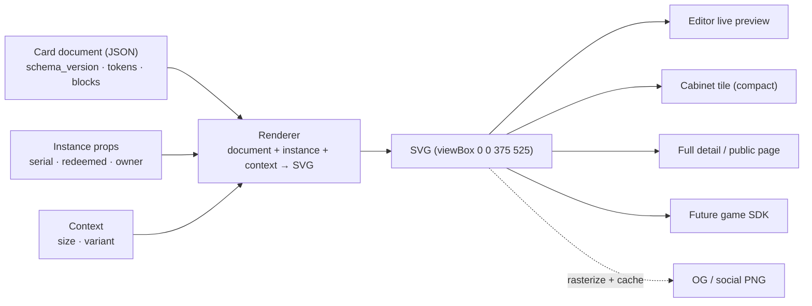

# Card Rendering Model (design)

This is a **design document**, not a description of shipped code. It specs how a
LatchDeck card is **stored as data and drawn on demand** — the "Templat: V1" base
card introduced in the new card editor (LatchDeck LatchApp), and the renderer that
turns it into pixels in every context it appears.

See also:

- [card-identity-and-provenance.md](card-identity-and-provenance.md) — card *design* vs. *instance* (serial, owner, ledger). This doc renders what that doc identifies.
- [latchdeck-api.md](latchdeck-api.md) — today's card shape (`latchdeck_cards_mvp`); this model formalises those scattered fields into one document.
- [../publiclatchdeckpage.md](../publiclatchdeckpage.md) — the viewer surface and the social/OG image need.
- [rarity-model.md](rarity-model.md) — rarity drives the badge + palette this renderer reads.

> **Status: planned.** Today a card is a row of discrete columns
> (`name_mvp`, `image_url_mvp`, `background_color_mvp`, `rarity_mvp`,
> `long_description_mvp`). "Templat: V1" replaces that with a single structured
> **card document**, drawn by a shared renderer. Encore remains the only writer;
> clients only render.

---

## 1. Core principle: store the card, not a picture of it

A card is **a tiny portable document**, never a saved PNG. The document holds the
design (layout, style tokens, content); a **renderer** draws it into whatever
surface it's appearing in, at the correct size and context.

> No PNG of the card is the **source of truth**. (A PNG is *derived* on demand for
> social/OG previews — see §7 — but it is never the stored card.)

Why this is the right call:

- **Resolution independence** — the same card renders crisp as a cabinet tile, a
  full detail view, an OG share image, or inside a future game SDK.
- **Re-styleable after the fact** — rarity frames, creator branding, Pro styles,
  even a platform-wide refresh happen in the renderer/tokens, not by re-exporting
  every image.
- **Per-instance data is injected at render time** — serial, redeemed date, and
  owner are *not* baked into the design (see §4).
- **Small, safe, real text** — JSON instead of (PNG × every instance); the body is
  selectable, searchable, screen-readable, and moderatable.

Everything below exists to make one contract hold:

> **`render(document, instance, context) → SVG`** — and every client (editor,
> cabinet, public page, OG image, SDK) is a client of that one renderer, exactly
> as every client is a client of Encore.

---

## 2. The card document format

```jsonc
{
  "schema_version": 1,
  "canvas": { "w": 375, "h": 525 },          // native design space → SVG viewBox; 5:7 (w:h)
  "tokens": {                                // semantic palette (see §5)
    "bg-base":  "#160000",
    "txt-base": "#5e0808"
  },
  "blocks": [
    { "type": "headline",    "text": "HEADLINE TEXT", "token": "txt-base" },
    { "type": "art",         "src": "latchdeck/cards/<creator>/<id>.png", "fit": "cover" },
    { "type": "rarityBadge", "value": "rare" },
    { "type": "divider" },
    { "type": "richText",    "content": { /* structured tree — §3 */ } },
    { "type": "footer",      "slot": "instance" }   // injected at render — §4
  ]
}
```

- **`canvas`** is the native design space (`375 × 525`). The renderer maps it
  straight onto an SVG `viewBox="0 0 375 525"` and scales to the target. There is
  one coordinate system; every surface is a scale of it.
- **`tokens`** are *semantic* names (your prototype's `bg-base` / `txt-base`), not
  raw colours sprinkled through the blocks. Rarity and theme can swap token values
  without touching content (see §5).
- **`blocks`** are an ordered list of typed, constrained blocks — **not** freeform
  HTML (see §3).

---

## 3. Block types — a *structured* content model, not HTML

The WYSIWYG editor is tempting to back with an HTML string. **Don't.** Raw HTML
breaks cross-platform rendering parity and opens XSS/moderation holes. The editor
edits a constrained, allow-listed block model that any renderer (browser or
server) can draw identically and safely.

| Block | Purpose | Notable fields |
| ----- | ------- | -------------- |
| `headline` | Card title ("HEADLINE TEXT") | `text`, `token` |
| `art` | The image region | `src` (S3 ref), `fit` (`cover`/`contain`) |
| `rarityBadge` | The "RARE" pill | `value` (`common`…`ultra`) → drives palette + label |
| `divider` | The rule under the badge | `token?` |
| `richText` | The commemoration write-up | `content` (structured tree, allow-listed) |
| `footer` | Serial + redeemed line | `slot: "instance"` — values injected (§4) |

**`richText.content` is a constrained rich-text tree** (recommend ProseMirror /
TipTap JSON — the editor already emits that), with an **allow-list**: nodes
`paragraph`, `text`; marks `bold`, `italic`. No arbitrary nodes, no embedded HTML,
no scripts. This is what makes "styled in a WYSIWYG editor" portable *and* safe.
The renderer flattens the tree to SVG `<text>`/`<tspan>` runs.

> Adding a block type (e.g. `stat`, `qr`) is a **schema bump** (§6), not a free-for-all.

---

## 4. Template vs. instance — the footer is the tell

`REDEEMED 29 JUN 2026 | #0001` is **not** part of the design. It is `card_instance`
data (serial, redeemed date, owner — see
[card-identity-and-provenance.md](card-identity-and-provenance.md)). The stored
*design* document carries a `footer` **slot**; the renderer injects the instance
values at draw time:

```jsonc
// instance props passed to render(), NOT stored in the design
{
  "serial_no": 1,
  "supply_cap": 100,
  "redeemed_at": "2026-06-29",
  "owner_handle": "viewer-handle"
}
// → footer renders: "REDEEMED 29 JUN 2026 | #0001"
```

Keeping instance data out of the design document is what lets **one design** back
**N owned copies** without duplicating anything. A draft/preview with no instance
yet renders the footer with placeholder/empty values.

---

## 5. Tokens, rarity, and Pro styling

Blocks reference **semantic tokens**, never literal hex. A card stores its base
tokens (`bg-base`, `txt-base`); **rarity** and **theme** supply palette overlays:

- `rarityBadge.value` selects a rarity → label + palette (frame colour, glow,
  badge styling). A "rare" vs "common" card is the **same document** with a
  different rarity overlay.
- **Pro** unlocks higher-fidelity token sets / animated styles (consistent with
  the existing `free`/`pro`/`sdk` tier gate in Encore). Free cards get flat tokens;
  Pro adds animated/holo overlays — still pure render, no new content.

This keeps content and styling orthogonal: the editor authors content + picks a
rarity; the renderer + tokens decide how it looks everywhere.

---

## 6. Schema versioning

Every stored document carries `schema_version` (the prototype is "V1"). The
renderer must draw **every** version it has ever supported — a V1 card minted today
must still render after V2 ships. Rules:

- Renderers switch on `schema_version`; never assume "latest".
- New block types / fields = a version bump, with a documented migration (lazy:
  upgrade on next edit, never a destructive rewrite of owned designs).
- Unknown future blocks degrade gracefully (skip + log), never crash a card.

---

## 7. The render pipeline & contexts



**Renderer contract:**

```ts
render(document: CardDocument, instance: InstanceProps | null, context: RenderContext): string // SVG
// context = { size: 'native'|'full'|'tile'|'og', width, height, variant?: 'compact' }
```

**Contexts to design for from day one:**

| Context | Notes |
| ------- | ----- |
| Editor live preview | WYSIWYG; re-renders on every change. |
| Cabinet **tile** | Small. Use a `compact` variant — drop `richText`, keep headline + art + rarity + serial. |
| Full detail / public page | Native aspect, scaled up. |
| **OG / social image** | The exception — see below. |
| Game SDK / external apps | Same renderer/spec; platform-agnostic. |

**Keep the 5:7 aspect and scale — never reflow.** A collectible should always look
like a card; small sizes get the `compact` variant, not a re-laid-out card.

**OG / social (the one derived PNG):** link unfurls (Discord, iMessage, X) can't
render live SVG. So an endpoint (e.g. `GET /og/card/:instance`) renders the
document+instance to SVG, **rasterises to PNG, and caches it** (S3/CDN). The PNG is
a *derivative*, regenerated if the design changes — the JSON stays the source of
truth. This is the image the redeem/social link from
[publiclatchdeckpage.md](../publiclatchdeckpage.md) needs.

---

## 8. Why SVG as the canonical target

- Vector → scales to any context with no asset variants.
- Renders identically in the **browser** (editor, public page) and **server**
  (OG rasteriser) — the parity that "draw it everywhere" depends on.
- Rasterises cleanly to PNG for OG.
- Maps directly onto the native `375 × 525` `viewBox` and the semantic tokens.

Trade-off to decide: rich-text layout in SVG is manual (`<text>`/`<tspan>` runs and
wrapping) rather than free-flowing like HTML/CSS. Acceptable given the constrained
body model; the alternative (HTML for editor, SVG for display) risks the two
drifting. Recommend **one SVG renderer** as the single source of visual truth.

---

## 9. Practical gotchas

- **Font parity** — the editor (browser web fonts) and the OG rasteriser (server)
  must embed the **same** fonts, or cards drift between preview and share image.
  Pin the card font(s) and embed them in the renderer.
- **Art is an S3 reference, not bytes** — `art.src` points at the public
  `latchdeck/cards/{latchid_user_id}/…` object (per the architecture doc). The
  renderer fetches/embeds; the document only stores the URL.
- **Moderation + AI policy** — `art` images and `richText`/`headline` text are
  user-supplied; both run through moderation, and the
  [AI Use Policy](../policies/ai-use-policy.md) applies. The structured model makes
  the text trivially extractable for moderation.
- **Aspect ratio** — `375 × 525` is **5:7 (w:h)**, the standard trading-card ratio.

---

## 10. Where it lives

- **Editor** — a new WYSIWYG card editor in Livelatch's LatchDeck Studio (the
  LatchApps section). It authors the card document and previews it with the shared
  renderer. It does **not** store state — it sends the document to Encore.
- **Storage** — Encore persists the document (a `card_document` JSON column on the
  card design, superseding the discrete `*_mvp` columns over time) in
  Supabase. Encore stays the single writer.
- **Renderer** — a shared, portable implementation (or a spec precise enough to
  reproduce) used by the editor, the public page, the OG endpoint, and the SDK.
  This is the artefact that makes every surface a client of one renderer.

---

## 11. Open questions

- **Renderer packaging** — one shared JS/TS renderer imported by every client, a
  WASM core, or a written spec each client implements? (Parity vs. coupling.)
- **Rich-text editor choice** — TipTap/ProseMirror (structured JSON out of the
  box) vs. a bespoke block editor.
- **OG cache invalidation** — regenerate on design edit; what TTL/key (per instance
  vs. per design)?
- **Animated/Pro styles in static contexts** — what does a holo/animated Pro card
  fall back to in the OG PNG and the cabinet tile?
- **Custom fonts per card** — fixed platform font set, or creator-selectable
  (with the embedding cost that implies for OG parity)?
