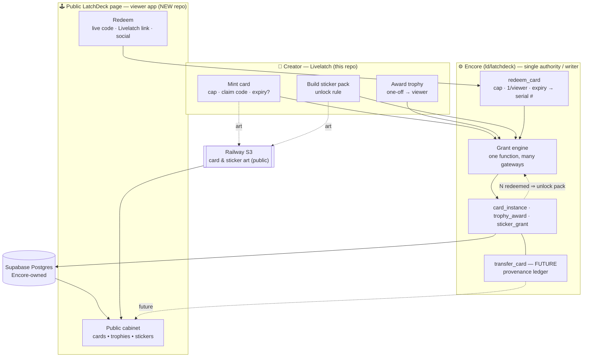
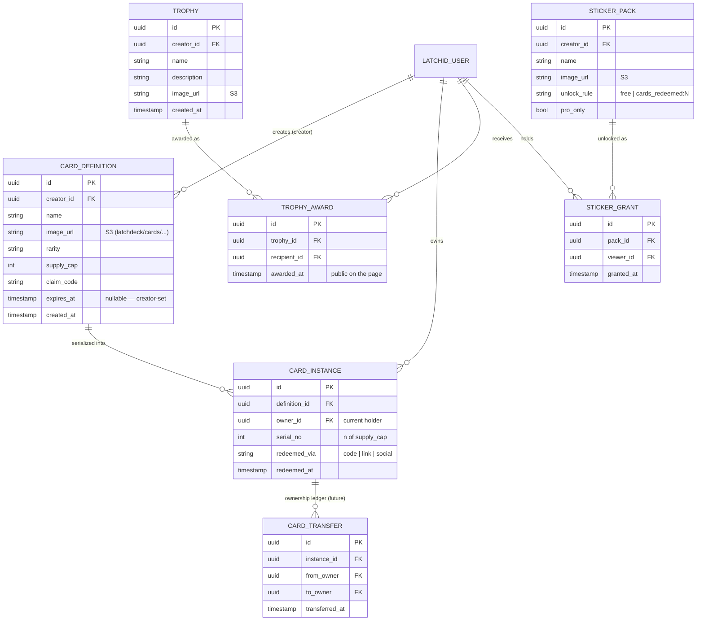

# Public LatchDeck Page (design)

This is a **design document**, not a description of shipped code. It specs the
**viewer-facing public LatchDeck page** — the place a viewer's collection is shown
off: the cards they've redeemed, the trophies a creator has awarded them, and the
sticker packs decorating their profile.

It is the *read* counterpart to the creator-side LatchDeck Studio. Where the
Studio lets a creator **mint** collectibles, this page lets a viewer **display**
the ones they own.

See also, in `docs/latchdeck/`:

- [latchdeck-architecture.md](latchdeck/latchdeck-architecture.md) — the systems, keys, and data store.
- [latchdeck-api.md](latchdeck/latchdeck-api.md) — the Encore API contract.
- [card-identity-and-provenance.md](latchdeck/card-identity-and-provenance.md) — card vs. instance, the provenance ledger (underpins serials + trading).
- [campaigns-and-mechanics.md](latchdeck/campaigns-and-mechanics.md) — the "many gateways, one grant engine" redemption model.
- [rarity-model.md](latchdeck/rarity-model.md) — how a card's perceived value is scored.

> **Status: planned.** The redemption/campaign layer this page reads from is the
> deferred reason Encore exists (see the architecture doc's *Deferred* section).
> Today only the creator-side card *designs* (`latchdeck_cards_mvp`) and Studio
> exist. The viewer app is a **separate new repo** that does not exist yet.

---

## 1. Where it lives

The public page is a **new, viewer-facing client of the LatchDeck (Encore) API** —
the same authority Livelatch's Studio and LatchOps already talk to. Like every
other client it holds **no LatchDeck state of its own**; it renders what Encore
returns.

| System | Role for this page |
| ------ | ------------------ |
| **Encore** (`ld/latchdeck`) | The single authority/writer. Owns redeem, award, grant, and (future) transfer logic and serves the read endpoints the page calls. |
| **Supabase Postgres** | The data store. Encore connects directly (owner role; RLS bypassed by design — rules live in Encore). |
| **Railway S3** | Holds card and sticker **art** (public reads) under `latchdeck/…`. Encore stores only the URL. |
| **LatchID** | Identity. A viewer *is* a LatchID account (`latchid_user_id`); this is how "one per viewer" and "who owns what" are enforced. |
| **Public LatchDeck page** (new repo) | A thin viewer-facing UI over the Encore read API. The page itself is **public**; redeeming/managing requires the viewer to be logged in via LatchID. |

This mirrors the platform-agnostic principle in the architecture doc: nothing but
Encore writes the `latchdeck_*` tables, so the viewer app — like a future game
SDK — is just another keyed client.

---

## 2. System flow



**How to read it:** creators mint/award/grant on the Livelatch side; every gateway
hands the same request to Encore's **one grant engine** (a code is just one way to
resolve *which* entitlement). Encore validates and writes the owned record to
Supabase; the public page reads it back and pulls art from S3. Accumulated redeems
feed the sticker unlock check; the dashed `transfer_card` path is designed-for but
unbuilt.

---

## 3. What the page renders

The page is a **public cabinet** keyed to a viewer (by their LatchID handle/id). It
has three sections, one per collectible type.

### 3.1 Cards
The viewer's **owned card instances** — not card *designs*. Each tile shows:

- Card art (from S3) and the creator's styling (`background_color`, rarity frame).
- **Serial number** — `#n of <supply>` — the thing that makes an instance feel
  owned (see [card-identity-and-provenance.md](latchdeck/card-identity-and-provenance.md)).
- Rarity label and, optionally, the card's perceived-value score from the
  [rarity model](latchdeck/rarity-model.md).
- Creator name + link back to the creator's Livelatch profile.

> Today's `latchdeck_cards_mvp` is one row per **design**. The per-copy
> `card_instance` (with `serial_no`, `owner_id`) is the planned layer this section
> depends on.

### 3.2 Trophies
Trophies a creator has awarded this viewer. **Public on the LatchDeck page** by
decision. One-off awards; each shows name, description, art, awarding creator, and
date. No quantity/serial — a trophy is recognition, not an edition.

### 3.3 Stickers
Sticker packs the viewer has unlocked, used to **decorate their own LatchDeck
page** (cosmetic layer, vs. the earned cards/trophies layer). Grants are
**pack-level** — you unlock the whole pack, not individual stickers. A pack's
`unlock_rule` is either `free` or `cards_redeemed:N` (redeem N of that creator's
cards to unlock theirs).

---

## 4. The redeem → display loop

```
Creator drops a claim code/link  ─┐
Viewer clicks Livelatch redeem link │   all three are the SAME request
Viewer follows a social link        ─┘   to Encore's grant engine
        │
        ▼
Encore redeem (one grant function):
  • resolve entitlement from the code/link
  • require a logged-in LatchID viewer  → enforces one-per-viewer
  • check supply cap not exhausted
  • check the card has not expired
  • allocate the next serial atomically  → no two viewers get #42
  • write card_instance (owner = viewer)
        │
        ▼
Public LatchDeck page reads it back and shows #n of <supply>
```

Redeem entry points (all collapse to one model — a card definition carries a
**claim code/slug + supply cap + one-per-viewer rule**):

1. A **code** the creator reads out during a live stream.
2. A **redeem link inside Livelatch** for active cards.
3. A **link to the card posted on the creator's socials**.

Because it's free and reach is the point, a shared claim code that anyone can
redeem (one per account) until the cap is hit is the default; public sharing of a
code is acceptable. An optional gate (e.g. account age) can be layered later
rather than switching to unique single-use codes.

**Serial allocation must be atomic** and owned by Encore — it is a classic race
under concurrent live redeems. This is exactly why redemption lives in Encore and
not in a client.

---

## 5. Expiry

Creators can **optionally** set a card expiry. Modelled as `expires_at` (nullable)
on the card definition:

- **Redeem-time:** Encore rejects a redeem after `expires_at` (the entry is no
  longer "active").
- **Display-time:** already-redeemed instances **do not disappear** when a card
  expires — ownership is permanent. Expiry closes the *redeem window*, it does not
  revoke owned copies. The page may show an "edition closed" marker on the design.

---

## 6. Trade-ready from day one

Trading is **not a current feature but will be added** — the schema is built for it
now so there is no painful migration later. Two design choices make it work
(detailed in [card-identity-and-provenance.md](latchdeck/card-identity-and-provenance.md)):

- `card_instance.owner_id` is the **current holder**, not "the redeemer". Redeem is
  simply the genesis transfer.
- A `card_transfer` **provenance ledger** exists in the schema from the first
  redeem; `transfer_card()` (the verb) is unbuilt. Provenance is recordable
  immediately, so a card's history is intact whenever trading ships.

Nothing on the public page assumes the redeemer is the permanent owner.

---

## 7. Identity, Pro, art, and the no-scoreboard rule

- **Identity:** the page is public to *view*; **redeeming and managing** require a
  LatchID login. A viewer = a `latchid_user_id` — reuse LatchID, do not build a
  second auth system.
- **Pro:** cards and stickers are **free**. Pro gates **creator-side customisation
  fidelity** (e.g. holo/animated styles, custom pack art), not viewer access —
  consistent with how the existing tier gate (`free`/`pro`/`sdk`) already works in
  Encore.
- **Art storage:** card and sticker images live on **Railway S3** with public
  reads (cards already under `latchdeck/cards/{latchid_user_id}/`); Encore stores
  only the URL. Same path the platform-agnostic render already relies on.
- **AI + moderation:** card art and stickers are user-supplied images, so the
  [AI Use Policy](policies/ai-use-policy.md) and image moderation both apply.
- **No scoreboard:** sticker unlocks are a per-(viewer, creator) threshold, never a
  global ranking. Collectibles are "I own this cool thing," not "I rank above you"
  — keep the fanservice principle intact: do **not** surface "who owns the most
  cards."

---

## 8. Data model

Today's live table is `latchdeck_cards_mvp` (one row per card **design**). The
public page depends on the **planned instance + grant layer** below. Naming here is
illustrative; the canonical definitions live in the Encore migrations and the
card-identity doc.



---

## 9. Encore endpoints this page needs (proposed)

None of these exist yet — the [API contract](latchdeck/latchdeck-api.md) currently
covers creator/admin flows only. The public page needs **read** endpoints plus the
**redeem** verb (the deferred campaign layer):

| Method & path (proposed) | Purpose |
| ------------------------ | ------- |
| `GET /public/collection/:latchid_user_id` | The viewer's owned cards (with serials), public trophies, and unlocked sticker packs — everything the cabinet renders. |
| `POST /redeem` | The single grant gateway: `{ code, latchid_user_id }` → validates cap/expiry/one-per-viewer, allocates serial, writes `card_instance`. |
| `GET /cards/:id/public` | A single card design's public face (for the social/redeem landing link). |
| `POST /transfer` *(future)* | `transfer_card()` — moves an instance's `owner_id` and appends to `card_transfer`. |

Read endpoints should be servable to an unauthenticated public viewer (the page is
public), while `POST /redeem` requires a logged-in LatchID viewer.

---

## 10. Open questions

- **Privacy toggle** — can a viewer hide their cabinet or specific items, or is it
  always fully public?
- **Trophy revocation** — can a creator rescind an awarded trophy, or is an award
  permanent like a card?
- **Sticker placement** — free-form decoration vs. fixed slots on the page?
- **Redeem gating** — do we ever want the optional account-age/follow gate on a
  claim code, or always-open?
